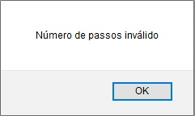
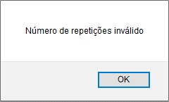

# 1. Com relação ao trabalho realizado

A disciplina INE5425 (Modelagem e Simulação), ministrada pelo professor Paulo Freitas na Universidade Federal de Santa Catarina (UFSC), teve como primeiro projeto do semestre 2017.1 um simulador em linguagem de propósito geral sobre “O andar do bêbado”.

## 1.1 Introdução

Neste trabalho, pedia-se para desenvolver uma aplicação de Monte Carlo que faria um cálculo de um **caminho aleatório** qualquer, simulando os passos de um bêbado. A analogia criada é justamente esta: verificar a distância percorrida por um sujeito bêbado.

## 1.2 Teoria

Foram passadas algumas fórmulas e parâmetros para simular o andar de um bêbado:

- O bêbado encontra-se em um plano;
- Ele pode dar um passo para qualquer direção (qualquer ângulo α) de 0 a 360 graus;
- Deve-se tomar em questão que o bêbado está em um plano (x, y);
- O ponto de partida é o ponto (0, 0).

# 2. Requisitos de sistema

## 2.1 Gráfico de caminho percorrido

Deve ser gerado um gráfico que demonstra todos os passos aleatórios possíveis que um bêbado pode dar, começando no ponto (0, 0) e determinado o caminho entre os pontos.

## 2.2 Gráfico de distância percorrida x distância estimada

Um gráfico que demonstra a distância percorrida pelo bêbado desde seu ponto inicial até seu ponto final, juntamente com a comparação da raiz de n que demonstra o número de classes.

- **Nota**: o número de classes deve ter valor máximo setado para 30.

## 2.3 Parâmetros fornecidos pelo usuário

Deve haver dois campos de livre digitação do usuário:

- Número de passos;
- Número de repetições.

Os dois campos são de preenchimento **obrigatório** e devem aceitar apenas caracteres do tipo número. Caso o usuário não preencha um dos campos, o sistema deve emitir uma mensagem de erro informando que este campo deve ser preenchido.


 *Imagem 1 - Exemplo de mensagem de erro número de passos inválido*


 *Imagem 2 - Exemplo de mensagem de erro número de repetições inválido*

Por padrão, quando o usuário abre o sistema pela primeira vez, o campo **Número de passos** deve vir preenchido com valor **10** e o campo **Número de repetições** deve vir preenchido com o valor **1**.

## 2.4 Histograma da amostra

Com o número de replicações da simulação também sendo informado pelo usuário, é possível determinar o número total de classes através da função **raiz de n**, porém, o número de classes máximo possível deve ser **30**; mesmo que **n** tenha um valor maior que 900.

# 3. Como utilizar o sistema

O **[manual do usuário](https://christianpieri.github.io/doc/docs/users_guide/index.html)** é um requisito de entrega do trabalho e está descrito nesta presente documentação na parte de Manual do usuário. Ele é um guia de como utilizar o sistema.

# 4. O código do trabalho

Como explicado na seção de tecnologias utilizadas, o projeto foi desenvolvido em JavaScript.
A principal função é a *startSimulation()*. Ela pega o número de passos e repetições que o usuário disponibiliza e plota os resultados em forma de gráficos.

O código da aplicação se baseia em basicamente dois arquivos, o index.html e o index.js.


### index.html

No index.html, se encontra o layout da aplicação, com as duas entradas para o fornecimento do número de passos e de repetições. Além disso, a página também contém um botão para início da simulação e os gráficos, inicialmente vazios. O botão, ao ser clicado, chama a função startSimulation() do arquivo index.js para então realizar a simulação e, por fim, plotar os gráficos para análise do usuário.

### index.js

Primeiramente é criada uma função para verificar se dada uma entrada **n**, a função **isNumeric(n)** retorna falso se o usuário inseriu algo que não um número, e verdadeiro caso tenha inserido um número válido para o programa.
``` javascript
function isNumeric(n) {
  return !isNaN(parseFloat(n)) && isFinite(n);
}
```
Aqui temos o início da função startSimulation(), a qual vai colocar valores default nas variáveis do programa, que são:
- Número de passos **(n_passos)** = 10;
- Número de repetições do programa **(n_repeticoes)** = 1.

``` javascript
function startSimulation(){
	var n_passos = 10 //default = 10
	var n_repeticoes = 1 //default = 1

```
Se o usuário alterou isso antes de clicar no botão, o próximo trecho de código vai alterar o valor dessas variáveis, além de utilizar a função criada anteriormente para checar se as entradas são válidas. Caso as entradas não sejam válidas, mostra-se o erro para o usuário e o programa não é executado. Isto é feito analisando a variável **erro**.

``` javascript
var erro = false

//Verificação se entradas de usuário são válidas:
tmp = parseInt(document.getElementById("passos").value);
if (isNumeric(tmp)){
  n_passos = tmp;
} else {
  alert('Número de passos invalido');
  erro = true
}

tmp = parseInt(document.getElementById("repeticoes").value);
if (isNumeric(tmp)){
  n_repeticoes = tmp;
} else {
  alert('Número de repetições inválido');
  erro = true
}

if (erro == false) { // Se não houver erro, continua a execução do programa
```
Neste ponto as variáveis iniciais já estão setadas, está na hora de começar a lógica do programa.

Primeiramente é criado um vetor, que é uma estrutura que vai armazenar os dados, chamado **distancias_finais**. Esse vetor é criado inicialmente vazio e vai armazenar a diferença entre a distância da posição final do bêbado e o esperado (raiz de n). Esta estrutura será usada posteriormente para a criação de um histograma de diferenças entre o observado e o esperado.

Então é criado um laço **for**, isto é, uma parte do código que vai se repetir quantas vezes for necessário. Neste caso ele vai repetir de acordo com a variável **n_repeticoes**, inserida pelo usuário.

``` javascript
var distancias_finais = [] //Diferença entre a distancia esperada(raiz de n) para a obtida em todas as repeticoes

for (var k = 0; k < n_repeticoes; k ++) {
```
Então para cada repetição, novas variáveis serão iniciadas para auxiliar no programa. São elas:
- **pos_x** e **pos_y**: são vetores que vão armazenar cada posição do eixo x e y do bêbado, respectivamente. Elas são iniciadas com o valor 0, pois a posição inicial será (0,0);
- **positions**: esta variável é utilizada para auxiliar na plotagem dos gráficos posteriormente, pois a biblioteca **Chart.js**, utilizada para gerar os gráficos, espera os dados no formato de dicionário, formato na qual esta variável é atribuída. Ela guarda os mesmos dados que os vetores **pos_x** e **pos_y**;
- **distances**: esta variável vai armazenando as distâncias do ponto atual do bêbado ao ponto inicial (0,0). Esta variável é muito importante, pois será comparada à raiz da quantidade de passos e preencher a variável **distancias_finais**;
- **raiz**: nesta serão armazenados os valores de raiz do número de passos que será utilizado posteriormente para calcular as distâncias finais. Inicia-se com 0, pois a raiz de 0 (passo número 0) é zero;
- **i**: número correspondente ao passo atual;
- **l**: tamanho do passo. No caso, sempre 1, conforme descrito pelo problema. Mas numa versão futura do software, poderia ser modificado.

``` javascript
  // Lista de posições
  var pos_x = [0]
  var pos_y = [0]
  var positions = [{x: 0, y: 0}]
  // Distancia percorrida inicial
  var distances = [{x: 0, y: 0}]
  //funcao sqrt(i) (raiz do numero de passos para comparacao)
  var raiz = [0]
  // num de passos
  var i = 0
  // tamanho do passo (longitude)
  var l = 1
  // -----------------------------------------
```
Após ter inicializado as variáveis, agora é executado um novo laço para realizar a lógica do problema para cada passo. O número de iterações deste laço varia de acordo com a variável **n_passos**.

Então, é setada uma variável **a** com o valor de uma distribuição uniforme no intervalo de 0 a 2π. A fórmula utilizada é r = 0 + u*(2π - 0), ou seja, um número aleatório entre 0 e 1 multiplicado por 2π.

Após isto, a variável **a** é utilizada para se calcular o valor das novas variáveis temporárias **next_x** e **next_y**, que representarão as próximas coordenadas a serem alcançadas pelo bêbado no próximo passo. Conforme descrito pelo problema, o próximo passo será definido pela posição atual somada com a multiplação entre **l** e o cosseno de **a** para o eixo x e seno de **a** para o eixo y.

``` javascript
  for (var j = 0; j < n_passos; j++) {
    // Distribuição uniforme -> r = a + u(b-a)
    var a = Math.random() * (2*Math.PI);
    // X(i + 1) = X(i) + l * cos(a)
    var next_x = pos_x[i] + l * Math.cos(a);
    var next_y = pos_y[i] + l * Math.sin(a);

```
As novas posições do bêbado são adicionadas as variáveis **pos_x**, **pos_y** e **positions**. Então o número do passo deve ser atualizado.

``` javascript

    pos_x.push(next_x);
    pos_y.push(next_y);
    positions.push({x: next_x, y: next_y})

    i ++;

```
Depois é calculada a distância através da raíz de x ao quadrado + y ao quadrado, conforme descrito pelo problema. Então essa distância é adicionada ao vetor **distances**.

Além disso, também é calculado a raíz do número de passos dados até o momento, e adicionado no vetor **raiz**.
``` javascript

    d = Math.sqrt(Math.pow(next_x,2) + Math.pow(next_y, 2));
    distances.push({x: i, y: d});

    raiz.push({x: i, y: Math.sqrt(i)});

  } // FIM DO LAÇO DE PASSOS

```
Neste ponto terminamos o laço dos **n_passos**. O que significa o fim de uma repetição. Neste ponto, é adicionado ao vetor **distancias_finais** o valor da diferença entre a distância final obtida e a distância final esperada (raiz de n).
``` javascript
  distancia = distances[n_passos]["y"] - raiz[n_passos]["y"];
  if (distancia < 0) {
    distancia = distancia * -1;
  }
  distancias_finais.push(distancia);
}
```
Aqui termina o laço da repetição, e as variáveis serão zeradas novamente para uma nova execução.

Ao final de todos estas repetições, teremos as posições do bêbado, as distâncias observadas e esperadas prontas para serem plotadas num gráfico.


Agora será feita uma distribuição dividida em classes para ser utilizada no histograma que vai mostrar as diferenças das distâncias finais.

Primeiro se obtém a diferença entre o máximo e o mínimo das **distancias_finais**, através das variáveis **max**, **min** e **diferença**.

O número de classes vai ser a raiz do número de repetições, mas se esse valor for superior a 30, o seu valor final fica em 30.

Então é calculado o intervalo, dividindo a diferença calculada anteriormente pelo número de classes.
``` javascript
max = Math.max(...distancias_finais);
min = Math.min(...distancias_finais);
diferenca = max - min;
n_classes = Math.floor(Math.sqrt(n_repeticoes));
if (n_classes > 30) {
  n_classes = 30;
}

intervalo = diferenca/n_classes;

```
Após, são feitas algumas rotinas para adicionar cada amostra em sua classe correspondente.

Primeiro é criado o vetor **limites_superiores** para salvar os limites superiores das classes e então para cada distância final encontrada, é feita uma verificação se o valor é menor que o limite superior. Se for menor, adiciona à classe correspondente, senão, analisa se é menor que a próxima classe. Isto se repete até que todas as amostras sejam atribuidas às classes.
``` javascript
limites_superiores = [];

aux = min;
frequencias = []

for(k = 0; k < n_classes; k ++) {
  aux += intervalo;
  limites_superiores.push(aux.toFixed(2)); //usando 2 casas pós a virgula
  frequencias.push(0);
}
for (k = 0; k < n_repeticoes; k ++) {
  for (j = 0; j < n_classes; j++) {
    if (distancias_finais[k] <= limites_superiores[j]) {
      frequencias[j] ++;
      break;
    }
  }
  if (distancias_finais[k] > limites_superiores[n_classes - 1]) {
      frequencias[n_classes - 1] ++;
    }
}
```
Então os dados estão prontos, a rotina de criação de gráficos de acordo com a biblioteca **Chart.js** é chamada e os gráficos são plotados na tela.

Vale salientar que o os gráficos de posição e de distâncias mostrados são correspondentes à última repetição. Somente o histograma final contém informações de todas as repetições. **Caso o número de repetições seja igual à 1, então o histograma não é mostrado**.

``` javascript

	// ----------------------------------------------------------------------
	// PLOTAGEM DOS GRÁFICOS
	// ----------------------------------------------------------------------

	//reset dos graficos
	  $('#chartPosition').remove(); // this is my <canvas> element
	  $('#chart-position-container').append('<canvas id="chartPosition"><canvas>');

	  $('#chartDistance').remove(); // this is my <canvas> element
	  $('#chart-distance-container').append('<canvas id="chartDistance"><canvas>');

	  $('#histograma').remove(); // this is my <canvas> element
	  $('#histograma-container').append('<canvas id="histograma"><canvas>');


	var ctx = document.getElementById("chartPosition");


	var myChart = new Chart(ctx, {
	    type: 'line',
	    data: {
	        datasets: [{
	            label: 'Posição',
	            data: positions,
	            fill: false,
	            lineTension: 0.1,
	            backgroundColor: "rgba(75,192,192,0.4)",
	            borderColor: "rgba(75,192,192,1)",
	            borderCapStyle: 'butt',
	            borderDash: [],
	            borderDashOffset: 0.0,
	            borderJoinStyle: 'miter',
	            pointBorderColor: "rgba(75,192,192,1)",
	            pointBackgroundColor: "#fff",
	            pointBorderWidth: 1,
	            pointHoverRadius: 5,
	            pointHoverBackgroundColor: "rgba(75,192,192,1)",
	            pointHoverBorderColor: "rgba(220,220,220,1)",
	            pointHoverBorderWidth: 2,
	            pointRadius: 2,
	            pointHitRadius: 10,
	            //data: [65, 59, 80, 81, 56, 55, 40],
	            spanGaps: false
	        }]
	    },
	    showTooltips: false,
	    options: {
	        scales: {
	            xAxes: [{
	                type: 'linear',
	                position: 'bottom'
	            }]
	        }
	    }
	});

	var ctx2 = document.getElementById("chartDistance");
	var myChart2 = new Chart(ctx2, {
	    type: 'line',
	    data: {
	        datasets: [{
	            label: 'Distância',
	            data: distances,
	            fill: false,
	            lineTension: 0.1,
	            backgroundColor: "rgba(175,150,192,0.4)",
	            borderColor: "rgba(175,150,192,1)",
	            borderCapStyle: 'butt',
	            borderDash: [],
	            borderDashOffset: 0.0,
	            borderJoinStyle: 'miter',
	            pointBorderColor: "rgba(175,150,192,1)",
	            pointBackgroundColor: "#fff",
	            pointBorderWidth: 1,
	            pointHoverRadius: 5,
	            pointHoverBackgroundColor: "rgba(175,150,192,1)",
	            pointHoverBorderColor: "rgba(220,220,220,1)",
	            pointHoverBorderWidth: 2,
	            pointRadius: 2,
	            pointHitRadius: 10,
	            //data: [65, 59, 80, 81, 56, 55, 40],
	            spanGaps: false
	        }, {
	        	label: 'Raiz de n',
	            data: raiz,
	            fill: false,
	            lineTension: 0.1,
	            backgroundColor: "rgba(175,50,92,0.4)",
	            borderColor: "rgba(175,50,92,1)",
	            borderCapStyle: 'butt',
	            borderDash: [],
	            borderDashOffset: 0.0,
	            borderJoinStyle: 'miter',
	            pointBorderColor: "rgba(175,50,92,1)",
	            pointBackgroundColor: "#fff",
	            pointBorderWidth: 0.5,
	            pointHoverRadius: 5,
	            pointHoverBackgroundColor: "rgba(175,50,92,1)",
	            pointHoverBorderColor: "rgba(220,220,220,1)",
	            pointHoverBorderWidth: 2,
	            pointRadius: 1,
	            pointHitRadius: 10,
	            //data: [65, 59, 80, 81, 56, 55, 40],
	            spanGaps: false

	        }

	        ]
	    },
	    showTooltips: false,
	    options: {
	        scales: {
	            xAxes: [{
	                type: 'linear',
	                position: 'bottom'
	            }]
	        }
	    }
	});

	if (n_repeticoes > 1) {
		var ctx3 = document.getElementById("histograma");
		var myChart = new Chart(ctx3, {
		    type: 'bar',
		    data: {
		        labels: limites_superiores,
		        datasets: [
		            {
		                type: 'bar',
		                label: 'Frequencias das distancias finais do esperado (raiz de n) em todas as repeticoes',
		                data: frequencias,
		                backgroundColor: 'rgba(255,133,0,0.7)'
		            }
		        ]
		    }
		});
	}
}
```
