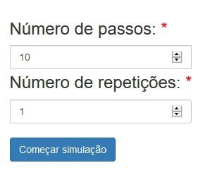
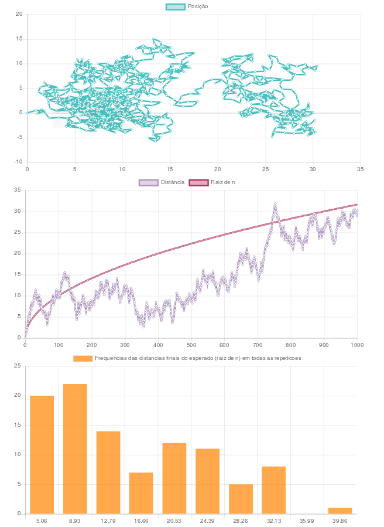

# 1. Campos
O sistema possui apenas dois campos para colocar dados:

- Número de passos;
- Repetições.

 *Imagem 1 - Campos para escrita dos valores*

# 2. Como utilizar
Para rodar a simulação do andar do bêbado é simples:

Basta escolher um número de passos que o "bêbado" vai dar e o número de repetições da simulação.

Isto pode ser feito de 2 formas: 

- Clicando nas setinhas de aumentar ou diminuir dos componentes ou
- Digitando no teclado o valor escolhido.

# 3. Para gerar os gráficos
Uma vez escolhidos os dois valores nos campos de dados, basta clicar no botão de **Começar simulação** e os gráficos serão gerados automaticamente.

 *Imagem 2 - Botão de iniciar simulação*

# 4. Para gerar uma nova simulação
Deve-se apenas repetir os passos **2** e **3** deste manual, trocando ou não, o número de passos e repetições escolhido.

 *Imagem 3 - Exemplo de gráfico gerado para 1000 números de passos e 100 repetições*
