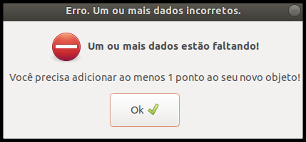
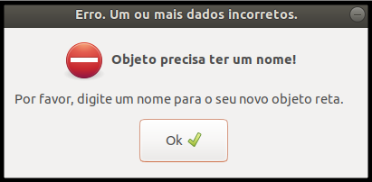

## Campos obrigatórios não preenchidos

#### 1. Tipo de mensagem
Mensagem padrão para alerta.

#### 2. Título
Erro. Um ou mais dados incorretos.

#### 3. Subtítulo
1. Um ou mais dados estão faltando!
2. Objeto precisa ter um nome!

#### 4. Mensagem
1. Você precisa adicionar ao menos 1 ponto ao seu novo objeto!
2. Por favor, digite um nome para o seu novo objeto ____.

#### 5. Regras
1. O subtítulo e a mensagem 1 devem ser exibidos ao tentar criar um polígono sem antes adicionar nenhum ponto a ele;
2. O subtítulo e a mensagem 2 devem ser apresentados quando o usuário criar um novo objeto e não dar um nome a ele.
3. No final da mensagem 2, o tipo ao qual o objeto está se referindo faltar o nome.

 
[Voltar](./)
