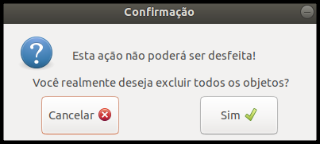

## Confirmação de exclusão de objetos

#### 1. Tipo de mensagem
Mensagem padrão para alerta.

#### 2. Título
Confirmação

#### 3. Subtítulo
Esta ação não poderá ser desfeita!

#### 4. Mensagem
Você realmente deseja excluir todos os objetos?

 
[Voltar](./)
