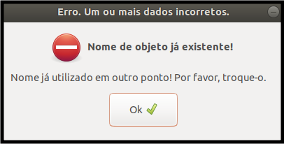

## Nome de objeto já existente

#### 1. Tipo de mensagem
Mensagem padrão para alerta.

#### 2. Título
Erro. Um ou mais dados incorretos.

#### 3. Subtítulo
Nome de objeto já existente!

#### 4. Mensagem
Nome já utilizado em outro objeto! Por favor, troque-o.

#### 5. Regras
1. Na mensagem, alterar o objeto pelo tipo do objeto a que a mensagem faz referência.

 
[Voltar](./)
