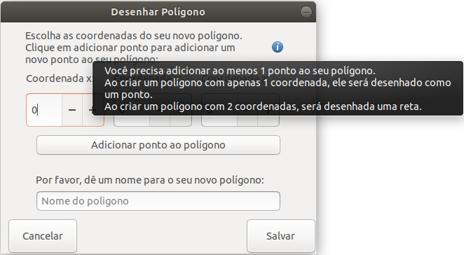

## Desenhar ponto

Este requisito descreve os comportamentos da tela de criação de polígonos.

#### 1. Breadcrumb
 > Desenhar Polígono > **Salvar**

#### 2. Campos
- Helper de contexto;
- Coordenada x;
- Coordenada y;
- Coordenada z;
- Botão de adicionar ponto ao polígono;
- Nome do ponto.

#### 3. Regras
1. Os campos de coordenadas devem receber valores entre [-1000, 1000];
2. Ao tentar digitar qualquer outro valor que não seja numérico, o campo altera seu valor para 0;
3. Se o usuário não entrar com valor algum, entende-se que o valor será 0;
4. O usuário deverá adicionar ao menos 1 ponto ao seu objeto polígono antes de clicar em salvar. Se ele tentar fazer isso, apresentar a mensagem: [Campos obrigatórios não preenchidos](./mensagens/campo-obg-n-preenc) referente a falta do ponto;
5. O campo nome é de caráter obrigatório e se não for fornecido deve-se apresentar a mensagem: [Campos obrigatórios não preenchidos](./mensagens/campo-obg-n-preenc);
6. Ao clicar em salvar, o sistema deverá:
- desenhar um objeto do tipo polígono respeitando as coordenadas fornecidas pelo usuário;
- traçar as linhas ponto a ponto, respeitando a ordem fornecida pelo usuário;
- traçar uma última linha do ponto final fornecido pelo usuário até o ponto inicial, afim de fechar o desenho;
- salvar este objeto juntamente ao seu tipo na lista de objetos desenhados;
7. Ao clicar em cancelar apresentar a mensagem no console: "Inclusão de polígono cancelada!".
8. O helper de contexto ajuda o usuário, que, ao passar o mouse em cima, obtém a seguinte mensagem: "Você precisa adicionar ao menos 1 ponto ao seu polígono. Ao criar um polígono com apenas 1 coordenada, ele será desenhado como um ponto. Ao criar um polígono com 2 coordenadas, será desenhada uma reta."

 
[Voltar](./)
