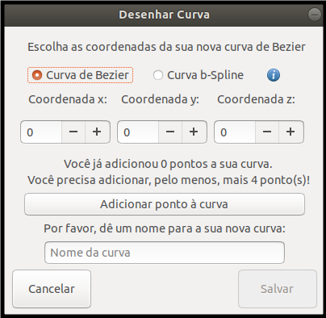

## Adicionando um novo objeto curva

Aqui será detalhado como adicionar um objeto do tipo curva

1. Na janela principal, clique em Desenhar Curva;
2. Abrirá uma modal como demonstrado na imagem abaixo:

3. Nesta modal você poderá escolher entre dois tipos de curvas: Bezier e bSpline;
4. Digite os pontos inicial, final e de controle da sua curva;
5. Dê um nome a ela e clique em salvar;
6. Ela será desenhada e aparecerá na lista de objetos, logo abaixo da caixa de controle.

 
[Voltar](./)
