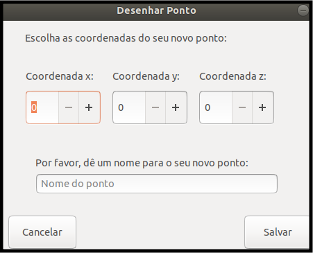

## Adicionando um novo objeto ponto

Aqui será detalhado como adicionar um objeto do tipo ponto

1. Na janela principal, clique em Desenhar Ponto;
2. Abrirá uma modal como demonstrado na imagem abaixo:

3. Nesta modal digite as coordenadas do seu novo ponto;
4. Dê um nome a ele e clique em salvar;
5. Ele será desenhado e aparecerá na lista de objetos, logo abaixo da caixa de controle.

 
[Voltar](./)
