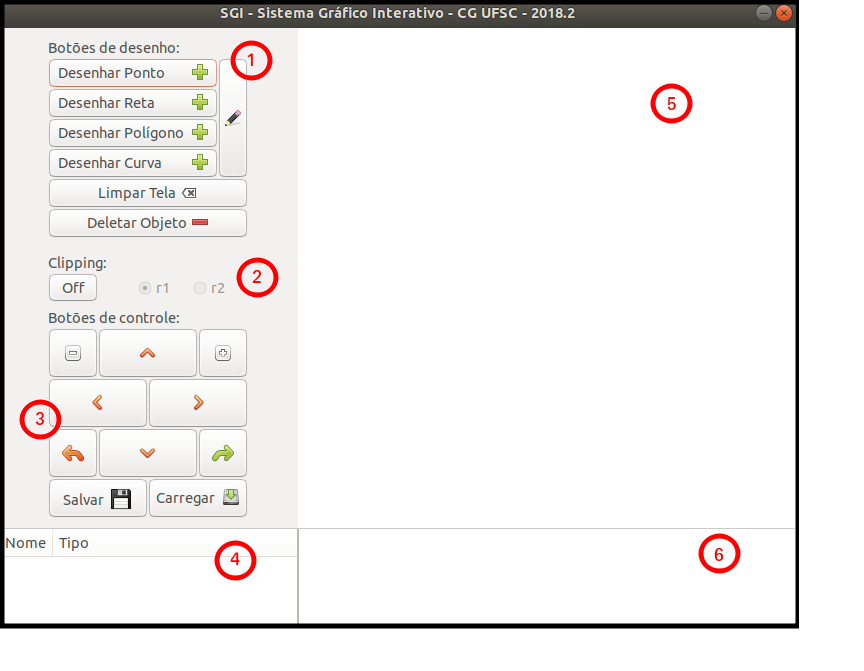

## Conhecendo o sistema

Aqui serão detalhados todas as áreas e botões do sistema

1. Caixa de botões de desenho;
2. Botão de clipping;
3. Botões da caixa de controle;
4. Lista de objetos desenhados;
5. Tela gráfica onde ficarão os desenhos;
6. Log para usuário acompanhar seus passos.

 
[Voltar](./)
