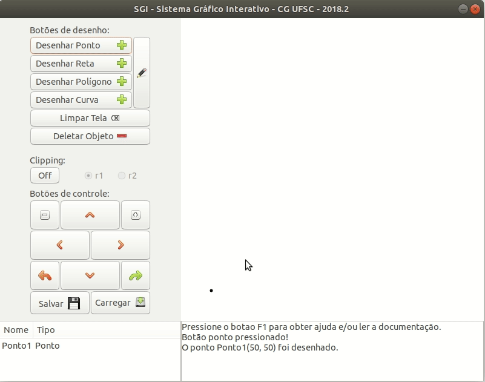

## Deletando um objeto

Aqui será detalhado como deletar um objeto

1. Na janela principal, selecione um objeto da lista de objetos;
2. Ainda na janela principal, clique em Deletar Objeto;
3. Este objeto será excluído da tela e da lista de objetos.

##### Teclas de Atalho
Alternativamente ao botão na tela principal, o usuário também poderá fazer uso do botão "delete" presente no seu teclado.

Nota: uma vez feita a ação de deleção de objeto, ela não poderá ser desfeita e você não obterá seu objeto novamente. A única forma é recriá-lo e redesenhá-lo utilizando os botões de desenho.

 
[Voltar](./)
