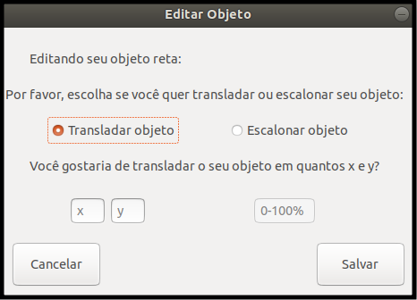

## Editando um objeto

Aqui será detalhado como editar um objeto

1. Na janela principal, selecione um objeto da lista de objetos;
2. Ainda na janela principal, clique em Editar Objeto;
3. Abrirá a modal de edição como mostrado abaixo:

4. Ao editar o objeto, você pode escolher entre transladá-lo e escaloná-lo;
5. Ao escolher transladar, informe quantos x e y você deseja deslocá-lo;
6. Ao escolher escaloná-lo, informe quantos % você deseja modificá-lo;
- 6.1 Ex: dobrar de tamanho - 200%; reduzir a metade - 50%;
7. Feito isto, clique em salvar.

Nota: objetos do tipo Ponto não podem ser escalonados.

 
[Voltar](./)
